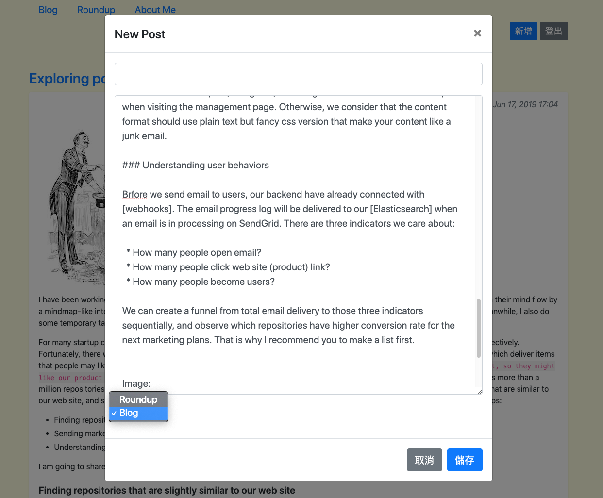

### MyBlog [WIP 開發中]

這個專案的出現，純粹是因為想要有一個工作記錄與部落格共存的個人網站，同時支援 Markdown 語法。訪間的解決方案是使用 Github 完成這件事，[嘗試過一陣子]，使終覺得綁手綁腳，且介面不好看，SEO 也滿有問題。過去我也常使用 static page 的方式架站，但自己寫自己要的工具網站，總是比較踏實。

本專案使用最傳統的 Django + Bootstrap 打造，Markdown 的渲染使用 [Marked], 我刻意避開過去常使用的前後端分離架構，儘管我很喜歡寫 Vue.js，我認為這個小專案不需要太複雜的架構，回歸單純。

#### 目前有什麼

- 所有的 Post (包含 Blog 或 Roundup)，都支援 Markdown 語法顯示。
- 有帳號管理，同一網站可支援多人寫作
- About me 也支援 Markdown 顯示（about me 目前顯示 owner 的描述）

#### Preview

[嘗試過一陣子]:https://github.com/yuecen/yuecen.net
[Marked]:https://github.com/markedjs/marked